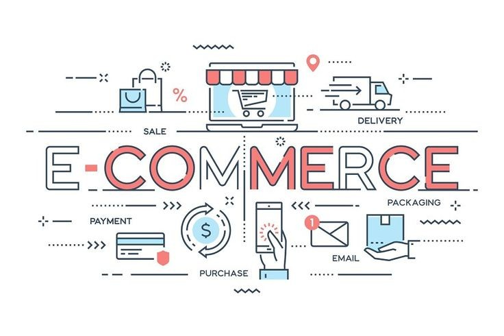
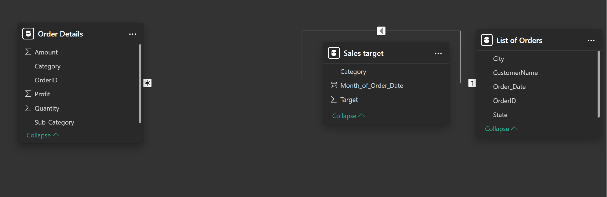
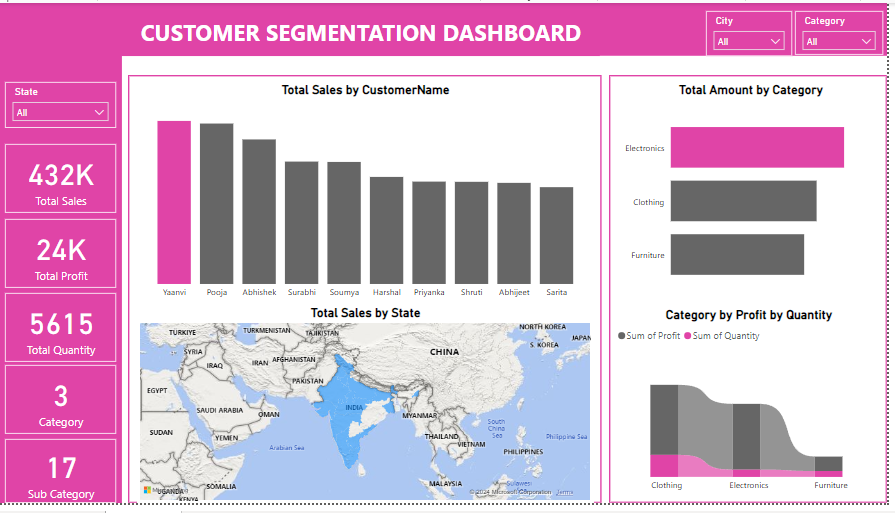
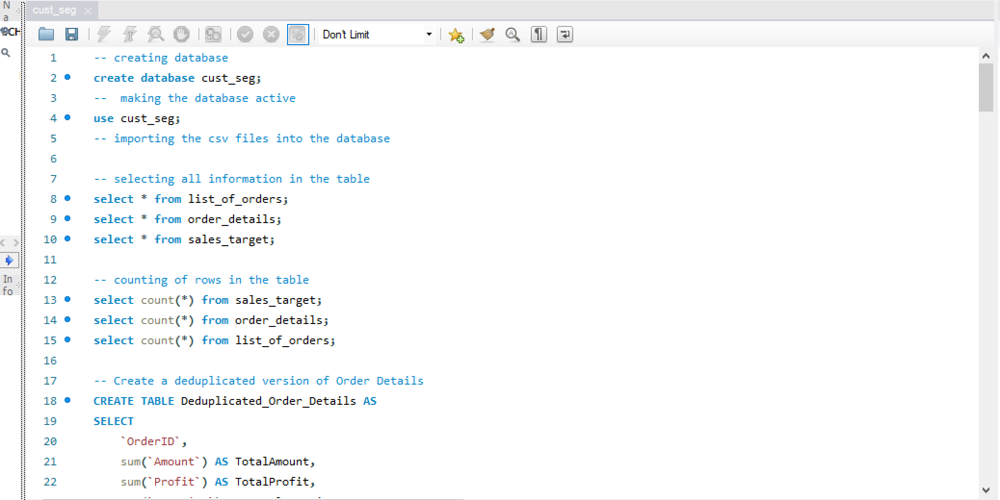
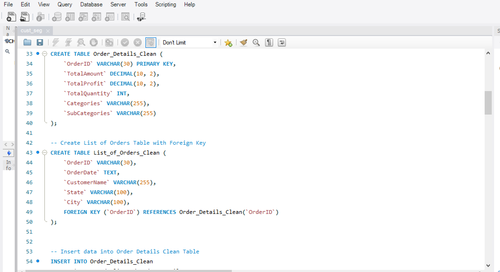
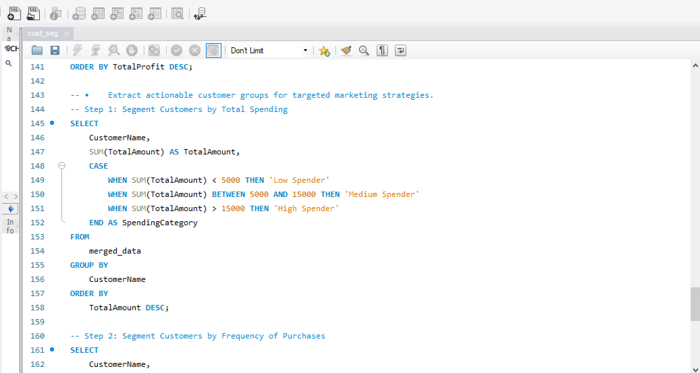
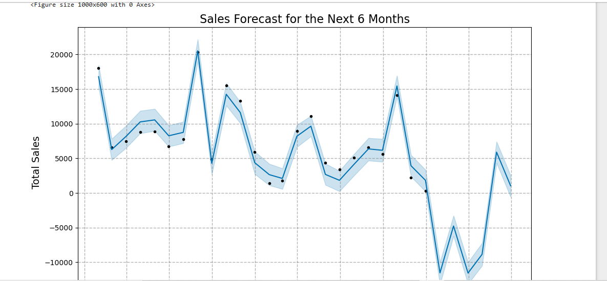
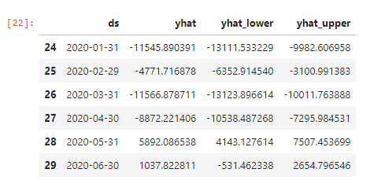

# E-commerce-Sales forecasting_and_Customer-segmentation

## Intrduction

In today's competitive business environment, understanding customer behavior and accurately predicting sales trends are critical to making data-driven decisions. This project aimed to utilize cutting-edge analytical techniques to segment customers effectively and forecast future sales, empowering the organization to enhance customer relationships and align resources strategically. 

## Problem statement
1. What is the customer with the highest sales?
2. Where is the state with the highest sales?
3. Which product has the highest and lowes sales?
4. Which categories has the highest profit by quantity?

## Skills demonstrated
The following skills were demostrated using the listed tools:
- Using SQL, customer purchase patterns were identified, and customers were segmented into groups based on spending and frequency.
- Python was utilized to forecast sales trends, uncovering significant seasonality and declining trends.
- Power BI visualizations highlighted top customers, states, and product categories, providing insights into performance across regions and segments.

## Modelling
Automatically derived relationships are placed below.

The model is a star schema.

## Visualization

The report comprises of Power BI Dashboard which Visualize customer segments to:
•	Display key metrics.
•	Create interactive dashboards showing geographical trends (State/City) of customer segments.
•	Highlight top customers, products, and categories contributing to each segment.

You can interact with the report [here](https://app.powerbi.com/groups/me/reports/6319b755-7411-443e-b6f0-6085802e5731/ReportSection?experience=power-bi)

Features:
- Barchart for the customers by Sales which derived the customer with the highest sales and for total sales by category.
- Map chart is used to visualize total sales by state to generate state with the highest sales.
- Slicers were added to the dashboard for filtering records and the data added are: category, state, city for easy filtering.
- Card chart was also added to summarize total amount, total profit, total quantity sold, total category and total sub categories. 

## Analysis

Using SQL to Perform customer segmentation by querying and analyzing data to:
•	Identify customer purchase patterns.
•	Group customers into segments 
•	Extract actionable customer groups for targeted marketing strategies.

You can interact with the report [here](https://drive.google.com/file/d/1qFxdzW1cHv7dShIGnPirnyooLwgAySP8/view?usp=drive_link)

 |  | 
Using SQL to Perform customer segmentation by querying and analyzing data to:
•	Identify customer purchase patterns.
•	Group customers into segments 
•	Extract actionable customer groups for targeted marketing strategies.

## SALES FORECASTING

USING PYTHON FOR SALES FORECASTING; the following were achieved:
- Aggregate sales data over time to identify trends and seasonality.
- Train and evaluate forecasting models (using Prophet Model).
- Provide actionable insights for category-specific sales planning.

You can check for the file [here](https://drive.google.com/file/d/1EuAfQvRCGDGf293VF3QnW1PZqIPGIzxS/view?usp=sharing)

## Summary

The analysis was performed on datasets containing order-level details, product information, and sales targets to achieve three objectives: customer segmentation, sales forecasting, and visualizing key metrics. Using SQL, customer purchase patterns were identified, and customers were segmented into groups based on spending and frequency. Python was utilized to forecast sales trends, uncovering significant seasonality and declining trends. Power BI visualizations highlighted top customers, states, and product categories, providing insights into performance across regions and segments.
Key Insights
1.	Customer Segmentation (SQL):
•	Customers like Abhishek and Yaanvi are high-value contributors due to frequent and significant purchases.
•	Low spenders, such as Ashwin, contribute minimally and require engagement strategies to improve their contribution.
•	Segmentation identified three groups: Low Spenders, Medium Spenders, and High Spenders, each requiring tailored marketing strategies.
2.	Sales Forecasting (Python):
•	Sales peaked in early 2018 but showed a consistent decline by 2019, with significant drops in December.
•	Forecasting (using the Prophet model) indicated negative sales for the initial months of the next period, followed by recovery in May and June.
•	Seasonal peaks were observed in January and August of 2018, guiding promotional planning.
3.	Visualization of Key Metrics (Power BI):
•	Yaanvi emerged as the top customer by sales, while Sarita had the lowest among the top 10.
•	Electronics was the top-performing category by sales, while Furniture lagged in both profit and quantity sold.
•	Geographical analysis identified top-performing states, aiding targeted regional strategies.

## Conclusion

The analysis highlights the variability in customer spending behavior, category performance, and geographical contributions. Sales trends showed significant seasonality, while forecasting suggests potential challenges in the near term. High spenders drive a majority of revenue, emphasizing the need to nurture this segment. The visualizations provide a comprehensive understanding of business performance, highlighting key opportunities and challenges.

## Recommendations

1.	Customer Retention and Engagement:
•	Reward loyal customers with personalized loyalty programs and exclusive offers.
•	Re-engage low spenders with targeted promotions, discounts, and introductory offers.
2.	Sales Growth Strategies:
•	Focus marketing efforts on Electronics, leveraging its strong performance.
•	Address underperforming categories like Furniture through pricing adjustments or better promotion.
3.	Seasonal Planning:
•	Align marketing campaigns and inventory with seasonal peaks (e.g., early-year and late-summer surges).
•	Prepare for the forecasted decline in early months by optimizing resources and exploring cost-cutting measures.
4.	Regional Optimization:
•	Prioritize high-performing states for regional campaigns.
•	Explore opportunities in underperforming states through localized promotions.
5.	Forecast Monitoring:
•	Continuously monitor actual sales against forecasted values to refine strategies.
•	Use insights from predicted recovery to plan for mid-year growth opportunities.
These insights and recommendations can help drive data-driven decision-making, improving customer satisfaction and overall business performance.🙂

